# Fedora Indestructible: Desktop (Workstation + KDE)

> *Your desktop should survive anything—even a broken update.*

## Table of Contents

- [Introduction](#introduction)
- [Prerequisites](#prerequisites)
- [Disk Partitioning Scheme](#disk-partitioning-scheme)
- [Installation Steps](#installation-steps)
  - [Initial Setup](#initial-setup)
  - [Disk Preparation](#disk-preparation)
  - [Partition Layout](#partition-layout)
  - [Subvolume Creation](#subvolume-creation)
  - [System Deployment](#system-deployment)
  - [First Boot](#first-boot)
  - [System Tuning](#system-tuning)
  - [Snapper Setup](#snapper-setup)
  - [GRUB-Btrfs Setup](#grub-btrfs-setup)
  - [DNF5 Plugin Setup](#dnf5-plugin-setup)
- [Post-Installation](#post-installation)
- [Final Notes](#final-notes)

## Introduction

This guide sets up Fedora Workstation or KDE Plasma Spin with a flat BTRFS subvolume layout, Snapper pre/post snapshots on every DNF5 and Discover transaction, and bootable snapshots via grub-btrfs.

This configuration is ideal for:
- Desktop users who want to undo bad updates in minutes
- Experimenting with drivers, kernels, and third-party repos
- Systems where Discover / PackageKit applies updates graphically
- Anyone who wants openSUSE-style rollbacks on vanilla Fedora

**Note**: this is classic DNF Fedora, not an immutable OS, snapshots protect against software issues, not disk failure. Keep external backups.

## Prerequisites

- **Installation Media**: Fedora Workstation or KDE Plasma ISO, booted in UEFI mode
- **System Type**: UEFI firmware
- **Disk Space**: Minimum 30 GB (more recommended for `/home` and snapshots)
- **RAM**: 4 GB minimum, 8 GB+ recommended
- **Internet Connection**: Required during installation

## Disk Partitioning Scheme

| Partition | Label | Type | Format | Size | Mount Point |
|-----------|-------|------|--------|------|-------------|
| **EFI System Partition** | `ESP` | EFI System Partition | FAT32 / vfat | 1 GiB (or 1.0737 GB) | `/boot/efi` |
| **System Partition** | `SYSTEM` | Linux Filesystem | BTRFS | Remaining space | - |

**Subvolumes**:

| Subvolume | Mountpoint | Purpose |
|-----------|------------|---------|
| `root` | `/` | This is the main subvolume where the most important system directories will reside, like: `/boot`, `/etc`, `/lib`, `/lib64`, `/usr`, `/mnt`, `/media`, `/afs`, `/bin`, `/dev`, `/proc`, `/sys`, `/run`, `/sbin`, `/root`, `/tmp` |
| `home` | `/home` | Subvolume for user home directory, can be managed by snapper with different settings |
| `opt` | `/opt` | Third-party software, excluded from snapshots |
| `srv` | `/srv` | Server role data, excluded from snapshots |
| `usr_local` | `/usr/local` | Locally compiled software, scripts and source codes, excluded from snapshots |
| `var` | `/var` | Variable data like: logs, VMs, containers, DBs. This subvolume will be configured with COW disabled |

**Notes:**
- Labels `ESP` and `SYSTEM` are **mandatory**, post-install commands use `blkid -L ESP` / `blkid -L SYSTEM`.
- Unlike Debian or Arch, Fedora no longer needs `/var` split into multiple subvolumes. Since Fedora 36 the RPM database lives in `/usr/lib/sysimage/rpm` (with `/var/lib/rpm` as a symlink). Source: [RelocateRPMToUsr](https://fedoraproject.org/wiki/Changes/RelocateRPMToUsr). This allows boot-to-snapshot and transactional-style recovery.
- The downside: `snapper rollback` is deeply integrated with [SUSE's nested subvolume layout](https://rootco.de/2018-01-19-opensuse-btrfs-subvolumes/) and GRUB plugins. On Fedora it leaves bootloader entries inconsistent, but now we have better workarounds for snapper to have easy and flexible rollbacks, see [plugin explanation](../plugin-explanation.md).
- No dedicated subvolume for `/root` mountpoint (root's home), RHEL design enforces `/root` as a mandatory directory inside `/`. Sources: [Bug 710388](https://bugzilla.redhat.com/show_bug.cgi?id=710388), [wayback machine](https://web.archive.org/web/20260928213401/https://bugzilla.redhat.com/show_bug.cgi?id=710388), [anaconda.conf](https://github.com/rhinstaller/anaconda/blob/7ad05432f13483177d1ff16cb4dd0addc072d6b7/data/anaconda.conf#L271).

## Installation Steps

### Initial Setup

Boot the Fedora ISO, and run Anaconda installer.

#### 1. Set language and keyboard

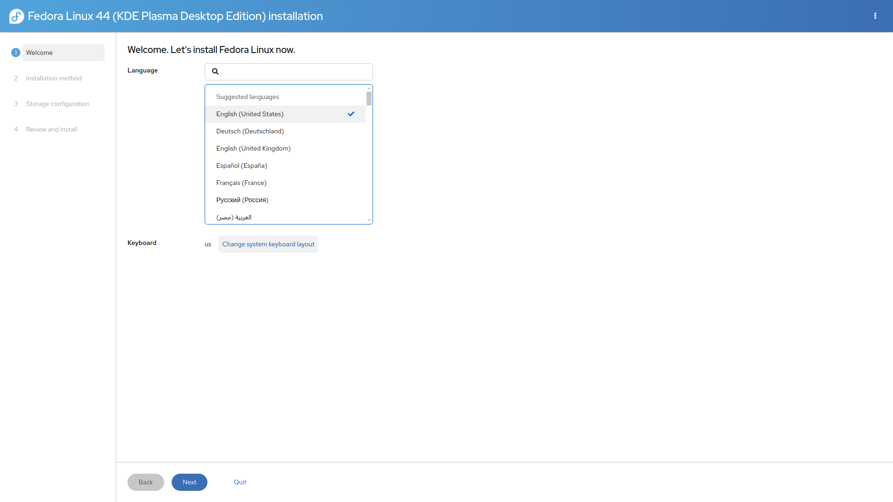

### Disk Preparation

#### 2. Select destination disk

Go to **Installation Destination** and select your disk.

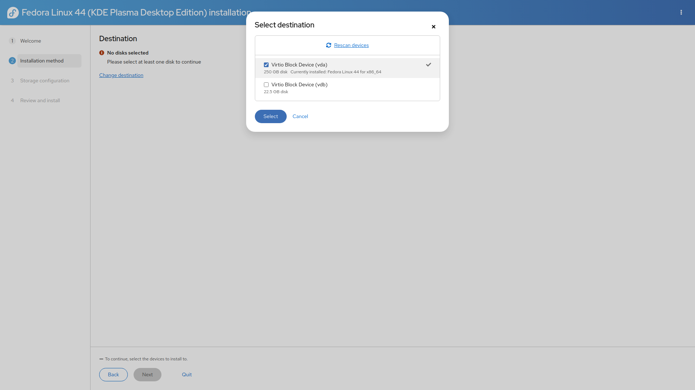

#### 3. Open the storage editor

Select **"Launch storage editor"**

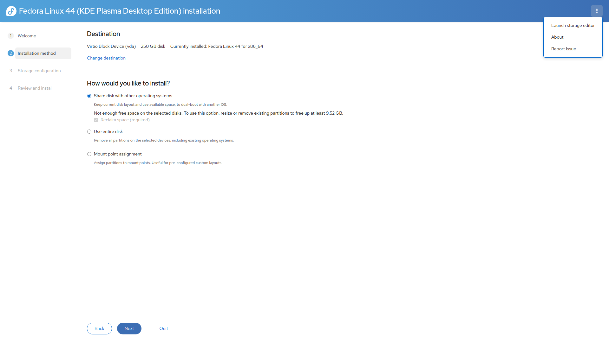

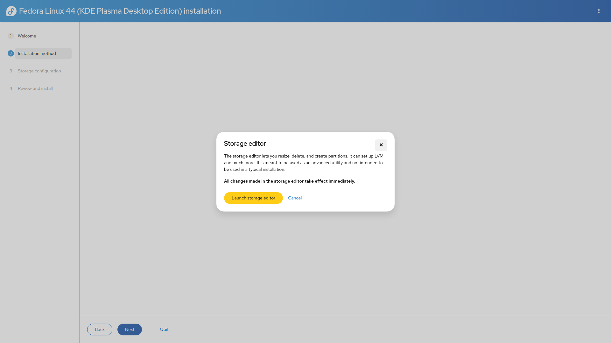

#### 4. Create a new GPT table

Delete old partitions if needed, then create a fresh **GPT** partition table, if you want a dual-boot setup, skip this step.

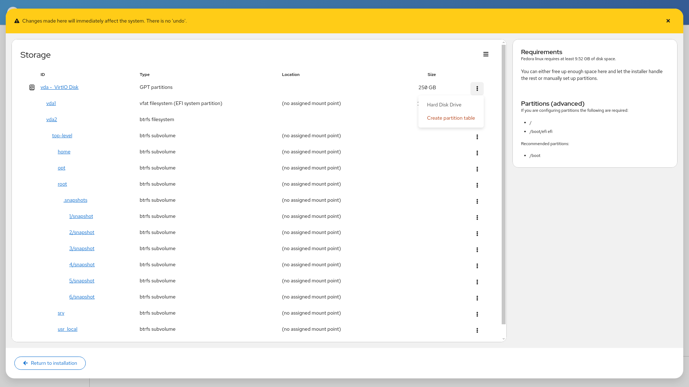

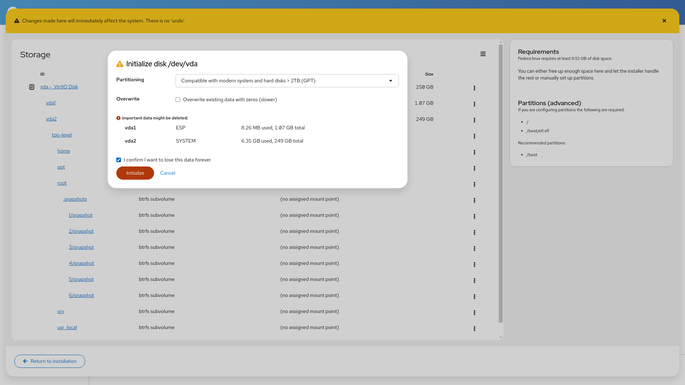

### Partition Layout

#### 5. Create the EFI partition

| Field | Value |
|-------|-------|
| Size | `1 GiB` (or 1.0737GB) |
| Filesystem | `EFI System Partition` |
| Label | `ESP` |
| Mountpoint | `/boot/efi` |

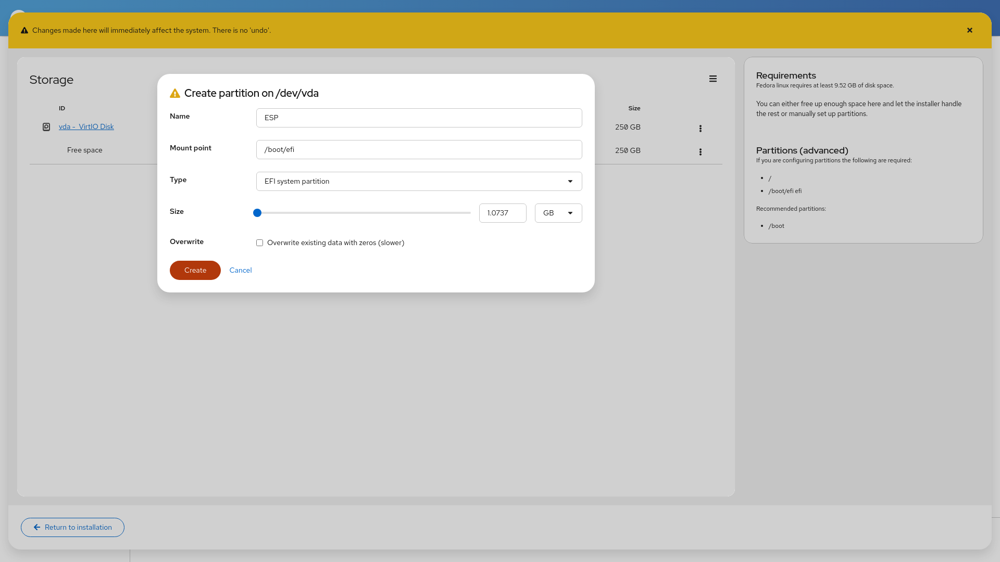

#### 6. Create the SYSTEM partition

Use all remaining space:

| Field | Value |
|-------|-------|
| Filesystem | `btrfs` |
| Label | `SYSTEM` |
| Mountpoint | leave blank |

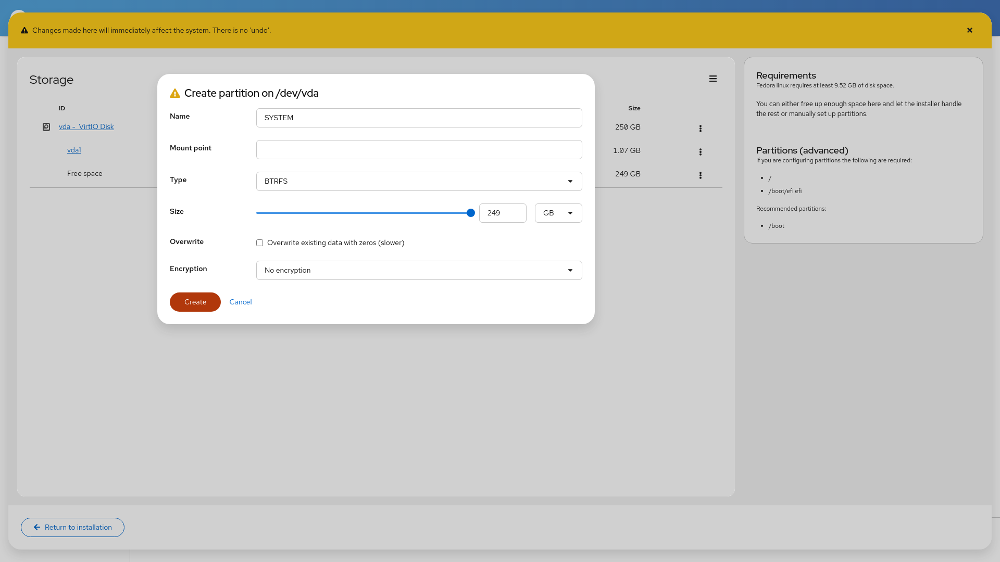

### Subvolume Creation

#### 7. Create subvolumes

Inside the `SYSTEM` Btrfs volume, create:

| Subvolume | Mountpoint |
|-----------|------------|
| `root` | `/` |
| `home` | `/home` |
| `opt` | `/opt` |
| `srv` | `/srv` |
| `usr_local` | `/usr/local` |
| `var` | `/var` |

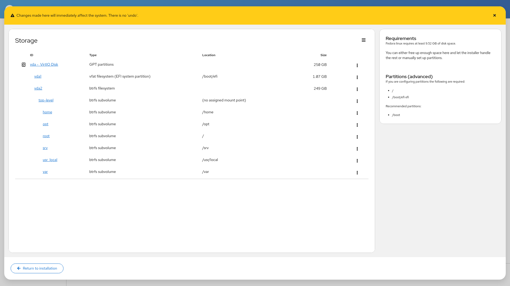

### System Deployment

#### 8. Return and continue

Click **Return to installation**, then **Continue**.

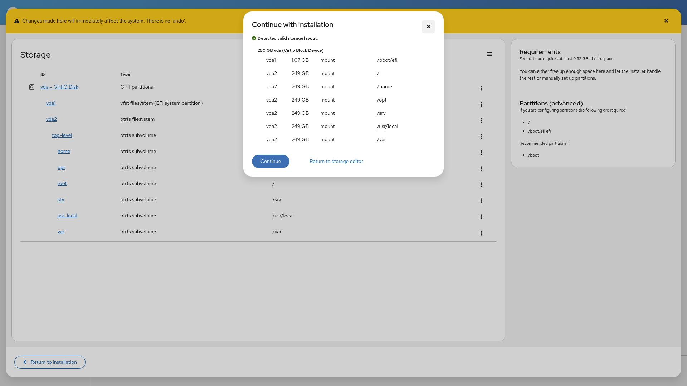

#### 9. Confirm and install

Review the summary, accept changes, and wait for the installation to complete.

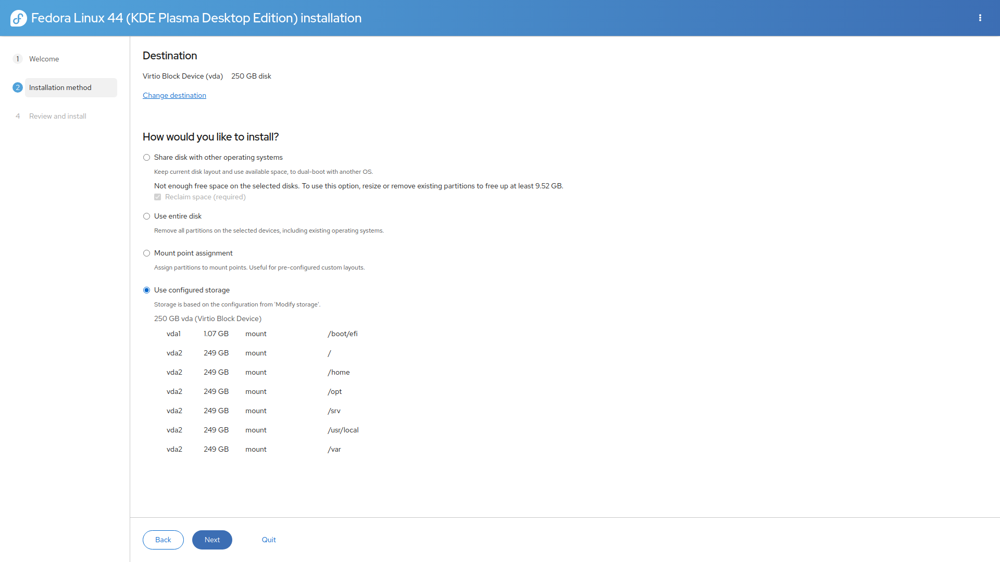

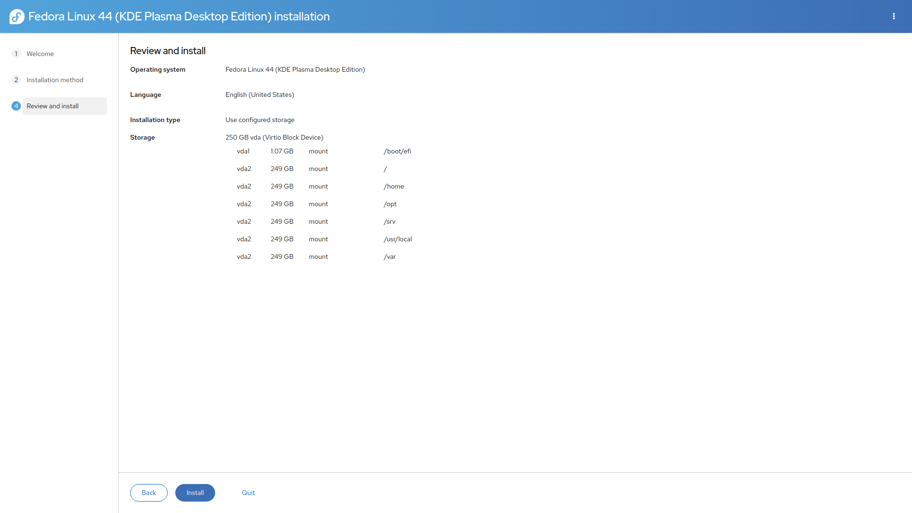

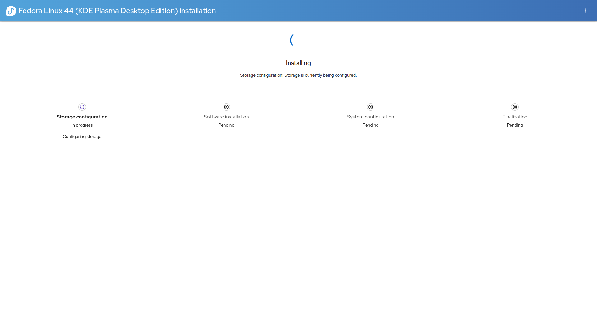

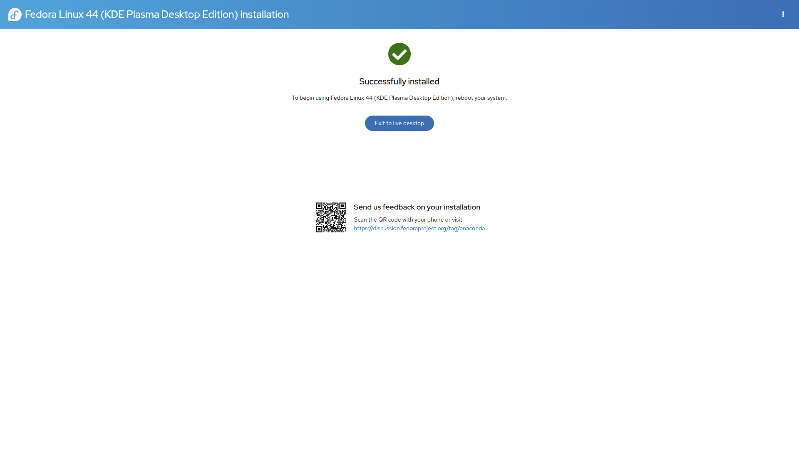

Reboot into the new installed system.

### First Boot

#### 10. Boot and complete Plasma setup

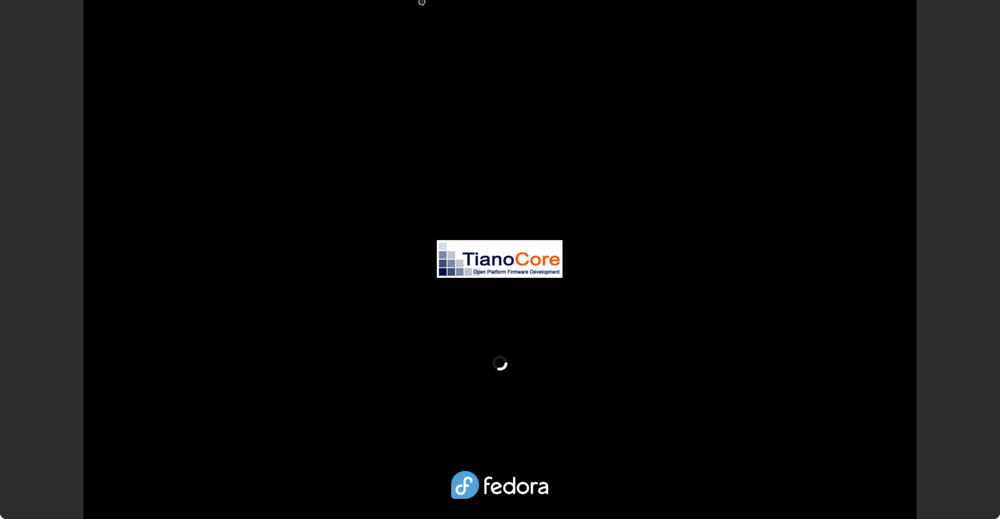

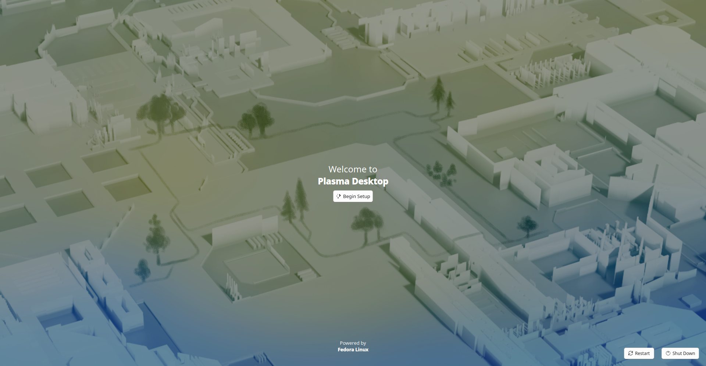

Complete the KDE first-run wizard (user, wifi, etc.).

### System Tuning

#### 11. Install utilities and clone the repo

```bash
sudo dnf install git snapper libdnf5-plugin-actions btrfs-assistant -y
```

```bash
sudo setenforce 0
cd ~/
git clone https://github.com/JMarcosHP/Fedora-Indestructible
```

> `scripts/first-boot-setup.sh` is provided as an automation entrypoint. Or you can run every command below manually.

#### 12. Remount the Btrfs top-level

```bash
SYSTEM="$(sudo blkid -L SYSTEM)"
ESP_UUID="$(sudo blkid -t LABEL=ESP -o value -s UUID)"
SYSTEM_UUID="$(sudo blkid -t LABEL=SYSTEM -o value -s UUID)"
sudo mkdir -p /mnt/fedora
sudo mount -o subvolid=5,noatime,nodiratime,space_cache=v2,compress=zstd:3 $SYSTEM /mnt/fedora
```

#### 13. Disable COW for `/var`

`/var` holds logs, crash dumps, VMs, containers, databases, and flatpaks. Random writes and fragmentation suffer under COW + compression:

```bash
cd /mnt/fedora
sudo mv var var-tmp
sudo btrfs su cre var
sudo chattr +C var
sudo cp -ar var-tmp/. var/

# Nested subvolumes (e.g. lib/portables) were flattened by the copy;
# rebuild each as a real subvolume, shallowest first.
NESTED_LIST="$(sudo btrfs subvolume list -o /mnt/fedora/var-tmp | sed -n 's/.* path //p' | sed 's|^var-tmp/||')"
if [[ -n "$NESTED_LIST" ]]; then
    echo "$NESTED_LIST" | awk -F/ '{print NF, $0}' | sort -n | cut -d' ' -f2- \
    | while IFS= read -r rel; do
        sudo mv "/mnt/fedora/var/$rel" "/mnt/fedora/var/$rel.migrate-tmp"
        sudo btrfs subvolume create "/mnt/fedora/var/$rel"
        sudo chattr +C "/mnt/fedora/var/$rel"
        sudo cp -ar "/mnt/fedora/var/$rel.migrate-tmp/." "/mnt/fedora/var/$rel/"
        sudo rm -rf "/mnt/fedora/var/$rel.migrate-tmp"
    done
fi

# Delete original nested subvolumes deepest-first, then var-tmp itself.
sudo btrfs subvolume list -o /mnt/fedora/var-tmp | sed -n 's/.* path //p' \
    | awk -F/ '{print NF, $0}' | sort -rn | cut -d' ' -f2- \
    | while IFS= read -r child; do
        sudo btrfs subvolume delete "/mnt/fedora/$child"
    done

sudo btrfs su del var-tmp
VAR_ID="$(sudo btrfs subvolume show /mnt/fedora/var | awk '/Subvolume ID:/ {print $NF}')"
sudo umount -l /var && sudo mount -o subvolid=$VAR_ID,noatime,nodiratime,space_cache=v2 $SYSTEM /var
```

Verify with `lsattr -d /mnt/fedora/var` (should show `C`).

#### 14. Tune `fstab` with compression and space_cache

```bash
sudo bash -c '
ESP_UUID="'"$ESP_UUID"'"
SYSTEM_UUID="'"$SYSTEM_UUID"'"
( head -n 10 /mnt/fedora/root/etc/fstab; cat <<EOF
UUID=$ESP_UUID                             /boot/efi   vfat   noatime,nodiratime,errors=remount-ro,umask=0077,shortname=winnt     0 1
UUID=$SYSTEM_UUID  /           btrfs  subvol=root,noatime,nodiratime,space_cache=v2,compress=zstd:3       0 1
UUID=$SYSTEM_UUID  /home       btrfs  subvol=home,noatime,nodiratime,space_cache=v2,compress=zstd:3       0 1
UUID=$SYSTEM_UUID  /opt        btrfs  subvol=opt,noatime,nodiratime,space_cache=v2,compress=zstd:3        0 1
UUID=$SYSTEM_UUID  /srv        btrfs  subvol=srv,noatime,nodiratime,space_cache=v2,compress=zstd:3        0 1
UUID=$SYSTEM_UUID  /usr/local  btrfs  subvol=usr_local,noatime,nodiratime,space_cache=v2,compress=zstd:3  0 1
UUID=$SYSTEM_UUID  /var        btrfs  subvol=var,noatime,nodiratime,space_cache=v2                        0 1
EOF
) > /mnt/fedora/root/etc/fstab.tmp && mv -f /mnt/fedora/root/etc/fstab.tmp /mnt/fedora/root/etc/fstab
'
```

Then reload and verify:

```bash
sudo systemctl daemon-reload
sudo mount -av
```

Note: `/var` intentionally has **no** `compress=zstd:3`.

#### 15. Recompress with zstd

```bash
sudo btrfs filesystem defragment -r -v -czstd /mnt/fedora/{root,home,srv,opt,usr_local}
cd ~/
```


#### 16. Unhide the GRUB menu

Fedora hides GRUB on single-OS installs, you need it to boot snapshots:

```bash
sudo grub2-editenv list
sudo grub2-editenv - unset menu_auto_hide
```

#### 17. Tune `updatedb`

See `configuration/updatedb.conf`. Apply with:

```bash
sudo cp ~/Fedora-Indestructible/configuration/updatedb.conf /etc/updatedb.conf
```

This prunes `/.snapshots`, `/var/*` caches, and bind mounts so `locate` stays fast on Btrfs.

### Snapper Setup

#### 18. Create and tune the root config

```bash
sudo snapper -c root create-config /

SNAPPER_USER=$USER

sudo snapper -c root set-config \
  ALLOW_USERS=$SNAPPER_USER \
  SYNC_ACL=yes \
  BACKGROUND_COMPARISON=yes \
  NUMBER_CLEANUP=yes \
  NUMBER_MIN_AGE=1800 \
  NUMBER_LIMIT=20 \
  NUMBER_LIMIT_IMPORTANT=20 \
  TIMELINE_CREATE=yes \
  TIMELINE_CLEANUP=yes \
  TIMELINE_MIN_AGE=1800 \
  TIMELINE_LIMIT_HOURLY=3 \
  TIMELINE_LIMIT_DAILY=2 \
  TIMELINE_LIMIT_WEEKLY=1 \
  TIMELINE_LIMIT_MONTHLY=0 \
  TIMELINE_LIMIT_YEARLY=0 \
  EMPTY_PRE_POST_CLEANUP=yes \
  EMPTY_PRE_POST_MIN_AGE=3600

sudo systemctl disable snapper-boot.timer
sudo systemctl enable --now snapper-timeline.timer
sudo systemctl enable --now snapper-cleanup.timer
```

### GRUB-Btrfs Setup

#### 19. Install grub-btrfs from COPR

```bash
sudo dnf copr enable jmarcoshp/grub-btrfs -y
sudo dnf check-update
sudo dnf install grub-btrfs -y
sudo systemctl enable --now grub-btrfsd.service

sudo sed -i \
  -e 's|^GRUB_BTRFS_IGNORE_SPECIFIC_PATH=("@")|GRUB_BTRFS_IGNORE_SPECIFIC_PATH=("root")|' \
  /etc/default/grub-btrfs/config

sudo grub2-mkconfig -o /boot/grub2/grub.cfg
```
You can check the .spec source [here](https://github.com/JMarcosHP/fedora-builds-copr/tree/main/grub-btrfs)

### DNF5 Plugin Setup

#### 20. Install pre/post snapshot hooks and rollback utility

```bash
sudo mkdir -p /etc/dnf/libdnf5-plugins/actions.d/
sudo install -m 644 ~/Fedora-Indestructible/scripts/snapper-plugin-dnf5/snapper.actions /etc/dnf/libdnf5-plugins/actions.d/
sudo chmod +x /etc/dnf/libdnf5-plugins/actions.d/snapper.actions
sudo install -m 755 ~/Fedora-Indestructible/scripts/snapper-plugin-dnf5/snapper-*.sh /usr/local/bin/
sudo chmod +x /usr/local/bin/snapper-*.sh
sudo install -m 755 ~/Fedora-Indestructible/scripts/system-rollback /usr/local/bin/system-rollback
sudo chmod +x /usr/local/bin/system-rollback
```

#### 21. Unmount, restore SELinux, and reboot

```bash
sudo umount -R /mnt/fedora
sudo setenforce 1
sudo reboot
```

## Post-Installation

Verify after reboot:

```bash
snapper -c root ls
sudo systemctl is-active grub-btrfsd.service snapper-timeline.timer snapper-cleanup.timer
ls -l /usr/local/bin/snapper-*.sh /usr/local/bin/system-rollback
```

## Final Notes

You now have:
- Flat Btrfs layout with compression enabled
- Snapper timeline + DNF5/Discover pre/post snapshots
- Bootable snapshots in GRUB
- `system-rollback` for safe full-system recovery
- BTRFS Assistant for GUI snapshot management

Next: test a rollback **now** while healthy, see [Rollback Guide](../rollbacks.md). Check the [troubleshooting section](../rollbacks.md#troubleshooting) if you find issues.

---

**Need help?** Check the [main documentation](../README.md) or open an [issue](https://github.com/JMarcosHP/Fedora-Indestructible/issues).
