# System Rollbacks with Snapper

> *Failure is not the end. It is a necessary part of the path - Eno Cordova*

## Table of Contents

- [Introduction](#introduction)
- [Understanding Snapshots](#understanding-snapshots)
- [Rollback Methods](#rollback-methods)
  - [Method 1: system-rollback on Running System (Recommended)](#method-1-system-rollback-on-running-system-recommended)
  - [Method 2: snapper undochange for Small Changes](#method-2-snapper-undochange-for-small-changes)
  - [Method 3: Pre-emptive Manual Snapshot](#method-3-pre-emptive-manual-snapshot)
  - [Desktop GUI: Btrfs Assistant](#desktop-gui-btrfs-assistant)
  - [Server: Cockpit + system-rollback](#server-cockpit--system-rollback)
- [Managing Snapshots](#managing-snapshots)
- [Troubleshooting](#troubleshooting)
- [Best Practices](#best-practices)
- [Final Notes](#final-notes)

## Introduction

One of the most powerful features of a Fedora Indestructible system setup is the ability to **roll back to any previous state**. Whether you've installed broken software, applied a faulty update, or accidentally misconfigured your system, snapshots let you undo these changes with a single command.

This guide covers CLI and GUI methods, from the safest (booting a snapshot from GRUB first) to the most flexible (live rollback or surgical undo).

## Understanding Snapshots

The system can create several types of snapshots:


| Snapshot Type | When Created | Purpose |
|---------------|--------------|---------|
| **Snapper Timeline** | Hourly, daily, weekly | Regular automatic backups of system state |
| **Snapper Pre/Post DNF5** | Before and after `dnf` / Discover / Cockpit transactions | Allows reverting failed updates |
| **Snapper Manual** | When you run `snapper create` | Custom snapshots before risky operations |
| **Backup** | After `system-rollback` (`root_backup_*`) or Btrfs Assistant restore | Records the state you rolled back from |

Each snapshot is:
- **Immutable** - Cannot be modified once created (read-only)
- **Space-efficient** - Only stores changed data (COW)
- **Bootable** - Can be booted directly using grub-btrfs
- **Numbered sequentially** - Pre/post pairs link via Pre # column
- **Flagged** - `important=yes` for kernel, bootloader, driver, offline updates

View all snapshots:
```bash
sudo snapper -c root ls
```

Example output:
```
 # | Type   | Pre # | Date                     | User | Cleanup | Description           | Userdata
---+--------+-------+--------------------------+------+---------+-----------------------+---------
 0 | single |       |                          | root |         | current               |
 1 | single |       | 2026-01-15 10:30:00      | root |         | first root filesystem |
 4 | pre    |       | 2026-01-16 09:15:00      | root | number  | dnf update            | important=yes
 5 | post   |     4 | 2026-01-16 09:20:00      | root | number  | dnf update            | important=yes
```

## Rollback Methods

### Method 1: system-rollback on Running System (Recommended)

**This is the safest full-system method** — works on a running system or booted snapshot, and never touches the default subvolume.

#### When to Use
- After a failed update that leaves the system unstable
- When you want to restore the whole `/` to a previous snapshot
- For big rollbacks (kernel, drivers, desktop environment)
- When the current system still boots (or after booting a snapshot from GRUB)

#### Step-by-Step Process

**1. Perform a change**

Run an update with Discover, Cockpit, or `dnf`. Wait for the transaction to fully finish so Snapper creates the matching pre + post snapshots.

> If you want to keep applying updates on reboot, you'll have to wait for the entire process to finish so that Snapper can generate the corresponding snapshots (pre- and post-) after the transaction.

**2. (Optional) Boot a snapshot first**

If the system is unhealthy, reboot, open the **grub-btrfs submenu**, and boot the desired snapshot. Then continue below from the booted snapshot, `system-rollback` derives the target from the snapshot path itself, so it stays correct.

**3. Find the snapshot number**

```bash
snapper -c root ls
```

**4. Roll back**

```bash
sudo system-rollback 4
```

This command:
- Mounts the Btrfs top-level (`subvolid=5`) on a temporary directory
- Renames `root` → `root_backup_<timestamp>`
- Creates a new writable snapshot in place of `root`
- Migrates child subvolumes (`.snapshots`) into the new `root`
- Verifies read-write state and untouched default subvolume

**5. Reboot**

```bash
sudo reboot
```

**6. Verify and clean**

Check that everything works, then remove the backup:

```bash
sudo system-rollback clean
```

Useful variants:

```bash
sudo system-rollback -n 4      # dry-run, change nothing
sudo system-rollback list      # list backups
sudo system-rollback clean all # delete all unused backups
sudo system-rollback --help
```

---

### Method 2: snapper undochange for Small Changes

**Fast and surgical**, reverts only files changed between two snapshots, on the live system.

#### When to Use
- Single-package installs you regret (`btop` test below)
- Small config mistakes
- You know the exact pre..post pair

#### Step-by-Step Process

**1. Install something**

```bash
sudo dnf install btop -y
btop
```

**2. Find the pair**

```bash
sudo snapper -c root ls
```

**3. Undo only that change**

```bash
sudo snapper -v -c root undochange <pre>..<post>
```

Where `<pre>` and `<post>` are the snapshot numbers generated after the dnf transaction.

**4. Verify**

```bash
btop   # should fail
```

---

### Method 3: Pre-emptive Manual Snapshot

**Proactive protection**, create a safety net before risky operations.

#### When to Use
- Before installing experimental software or drivers
- Before major config changes
- Before kernel updates on custom hardware

#### Step-by-Step Process

**1. Create a manual snapshot**

```bash
sudo snapper -c root create --description "Before installing NVIDIA drivers"
```

**2. Perform your risky operation, test, and roll back if needed**

```bash
sudo snapper -c root ls
sudo system-rollback <pre-snapshot-number>
sudo reboot
```

**3. If changes worked, delete or keep the safety snapshot**

```bash
sudo snapper -c root delete 42
```

---

### Desktop GUI: Btrfs Assistant

For KDE / Workstation users who prefer clicks.

**1. Update via Discover**

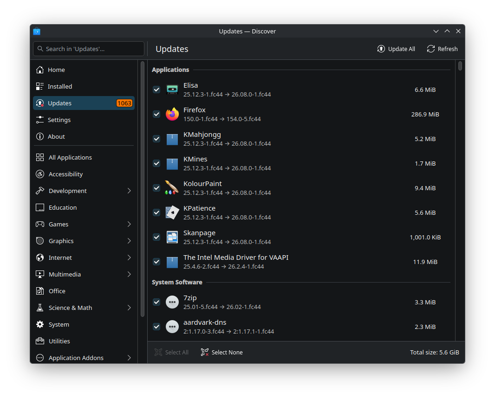

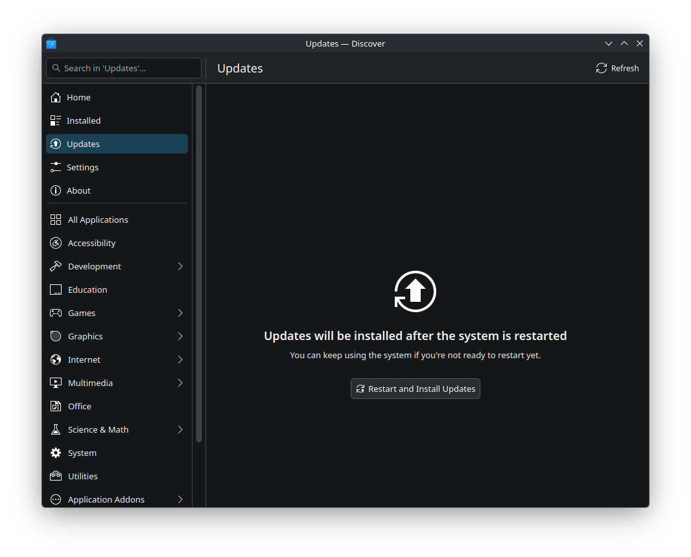

Reboot to apply the updates.

**2. Open Btrfs Assistant → Snapper tab**

Find the `GUI update` pre/post pair. Select the **pre** snapshot → **Restore**.

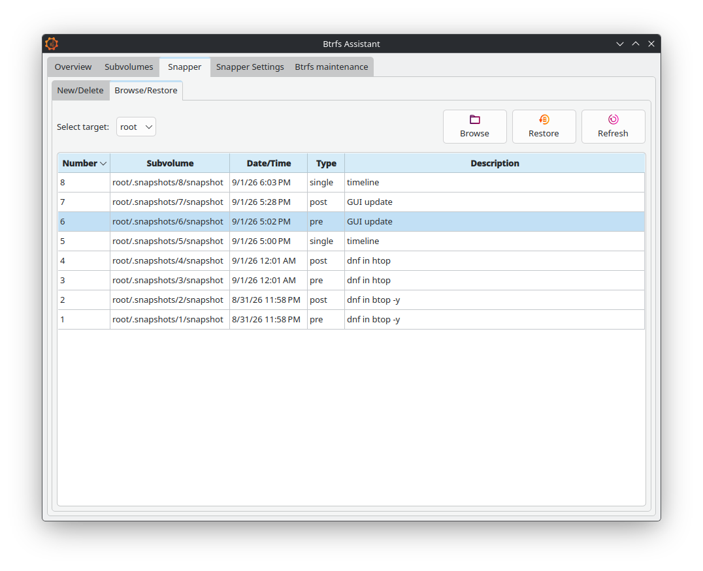

**3. Name the backup and confirm**

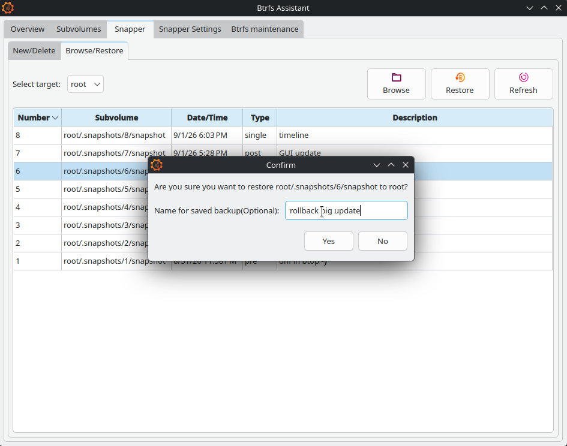

**4. Reboot**

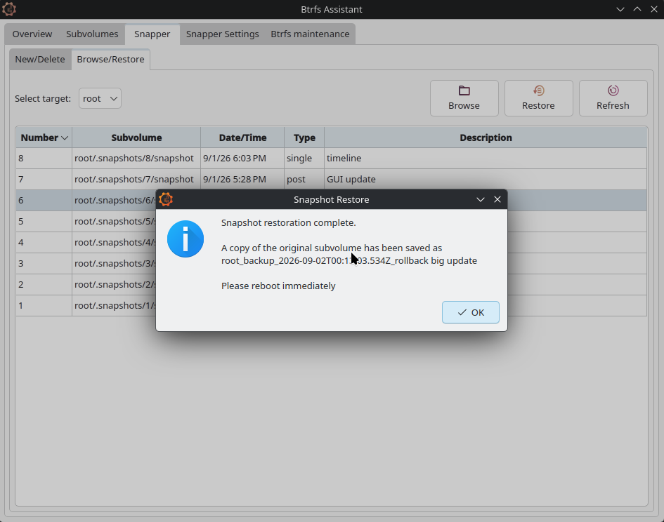

**5. Confirm updates are offered again**

```bash
sudo dnf makecache --refresh
sudo dnf check-update
```

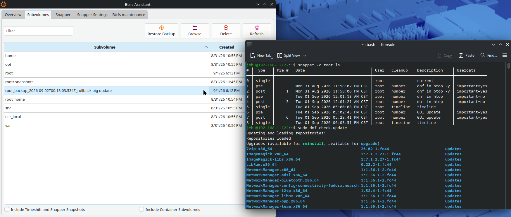

**6. Delete the backup**

Once happy, delete the backup Btrfs Assistant created.

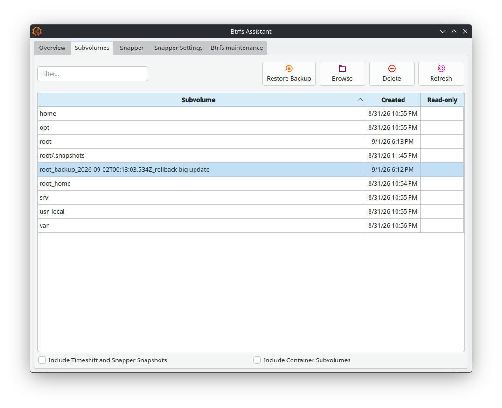

---

### Server: Cockpit + system-rollback

For Fedora Server with Headless Management.

**1. Update via Cockpit Software page**

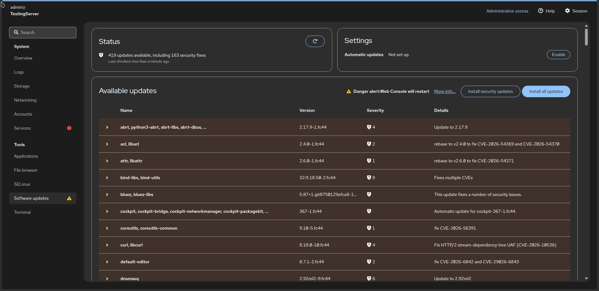

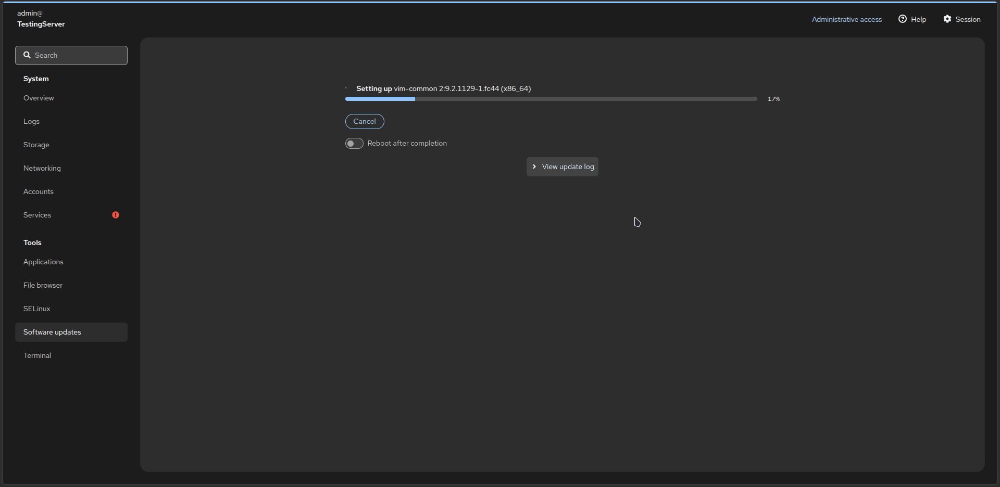

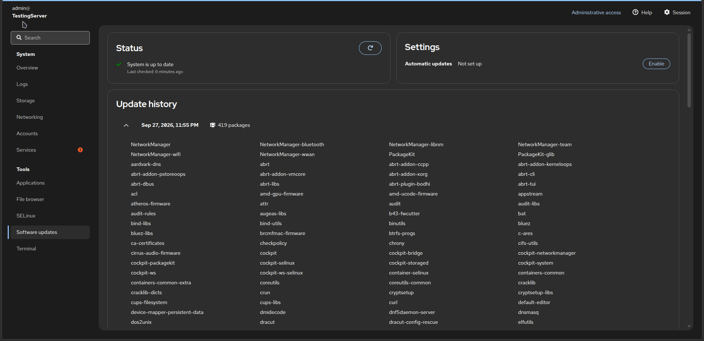

**2. Find the pre snapshot**

Look for the pre `GUI update` snapshot number in the root config.

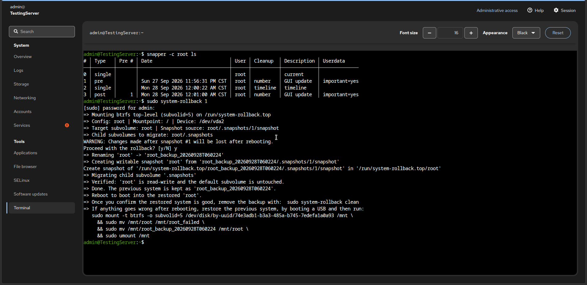

**3. Roll back and reboot**

```bash
snapper -c root ls
sudo system-rollback <ID>
sudo reboot
```

Or boot the snapshot via grub-btrfs first, then run `system-rollback`.

**4. Verify in Cockpit or CLI**

Reopen Cockpit and check for pending updates, or:

```bash
sudo dnf makecache --refresh
sudo dnf check-update
```

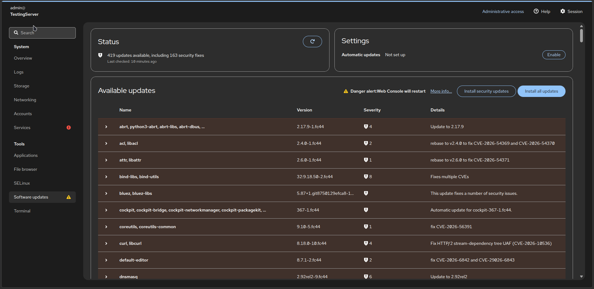

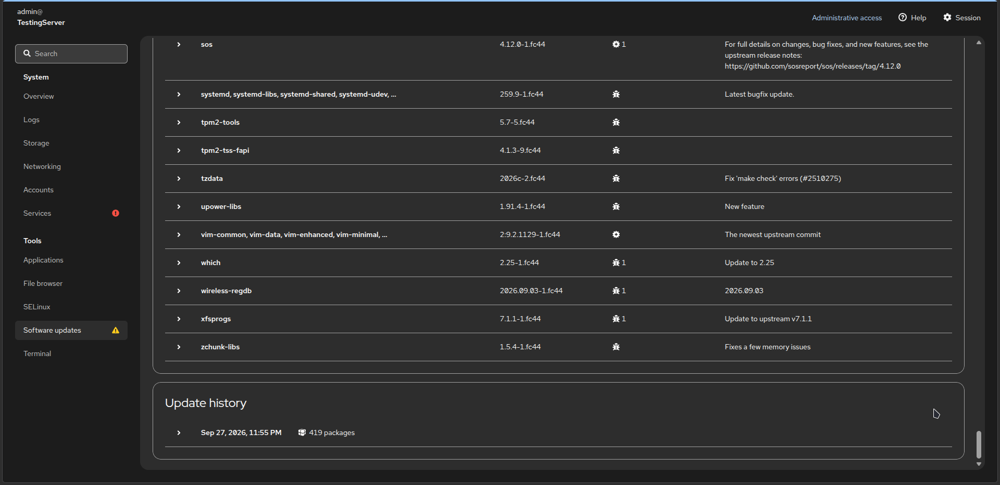

**5. Delete the backup**

```bash
sudo system-rollback clean
```

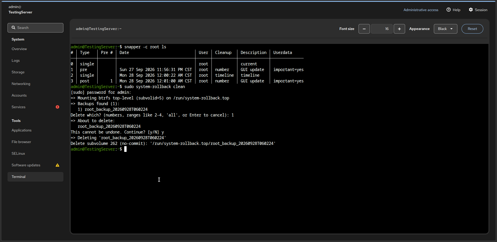

## Managing Snapshots

### Viewing Snapshot Details

**Compare two snapshots:**
```bash
sudo snapper -c root status 3..5
```

**View snapshot info:**
```bash
sudo snapper -c root info 3
```

### Creating Manual Snapshots

```bash
sudo snapper -c root create --description "Before system upgrade"
```

### Deleting Snapshots and Backups

```bash
sudo snapper -c root delete 42
sudo snapper -c root delete 10-20
sudo system-rollback list
sudo system-rollback clean
```

**Warning**: Never delete:
- Snapshot #0 (current system)
- Currently booted snapshot
- The `root_backup_*` marked `[in use]` — that's your running system after a rename

## Troubleshooting

### No snapshots after dnf / Discover / Cockpit updates

Check that the Snapper plugin is installed and executable:
```bash
snapper -c root ls
ls -l /etc/dnf/libdnf5-plugins/actions.d/snapper.actions
ls -l /usr/local/bin/snapper-*.sh
systemctl status snapper-timeline.timer snapper-cleanup.timer
```

- `snapper.actions` missing → redo [DNF5 Plugin Setup](guides/DESKTOP.md#dnf5-plugin-setup).
- `libdnf5-plugin-actions` missing → `sudo dnf install libdnf5-plugin-actions -y`.

### Snapshots exist but GRUB shows nothing

Check that `grub-btrfsd` daemon is running and the ignore list is correct, or if grub.cfg is outdated:
```bash
systemctl is-active grub-btrfsd.service
sudo grub2-mkconfig -o /boot/grub2/grub.cfg
grep IGNORE /etc/default/grub-btrfs/config
```

- Inactive daemon → `sudo systemctl enable --now grub-btrfsd.service`.
- Missing ignore → must be `GRUB_BTRFS_IGNORE_SPECIFIC_PATH=("root")`.

### GRUB menu never appears

```bash
sudo grub2-editenv list
sudo grub2-editenv - unset menu_auto_hide
grep GRUB_TIMEOUT /etc/default/grub
```

### Failed/incorrect rollback with `system-rollback`

If you accidentally rolled back to the wrong snapshot, you can still undo it with the backup created by `system-rollback`.

- If the system is still running, execute:
```bash
sudo system-rollback list
sudo blkid -L SYSTEM
sudo mount -o subvolid=5 /dev/disk/by-uuid/<SYSTEM_UUID> /mnt && sudo mv /mnt/root_backup_* /mnt/root && sudo umount /mnt
reboot
```

* If the main system is unbootable, but grub-btrfs still shows a working snapshot entry, boot it and run the same commands above to restore the backup.

* If none of the grub entries work, boot a live USB, mount the Btrfs top-level (`subvolid=5`), and rename the backup back to `root` as shown above.

A failed rollback usually tries to undo as much as possible, so a failed run does not need manual recovery. Three cases, in the order a rollback can fail:

* Renamed the target as backup subvolume but never created the new RW snapshot -> rename back.

* Created the new snapshot but a later step (child migration) failed -> move back any children already migrated, delete the new snapshot, then rename the backup back to the original name.

* Failure has nothing to do with the swap (e.g. before renaming anything, or after everything succeeded) -> nothing to undo.


## Best Practices

### 1. Regular Snapshot Hygiene
- Review monthly: `sudo snapper -c root ls`
- Keep important milestones with clear descriptions

### 2. Test Rollbacks Periodically
- Boot old snapshots to verify they work
- Familiarize yourself with `system-rollback -n` (dry-run)

### 3. Before Major Changes
```bash
sudo snapper -c root create --description "Before [what you're doing]"
```

### 4. Combine with External Backups
Remember: **Snapshots are NOT backups!**
- Snapshots protect against software issues
- Backups protect against hardware failure

### 5. Monitor Disk Space
```bash
df -h /
sudo btrfs filesystem usage /
```

Keep at least 10-20% free for optimal BTRFS performance.

---

## Final Notes

You now have four powerful methods to undo system changes:

| Method | Safety | Speed | Use Case |
|--------|--------|-------|----------|
| **system-rollback** | ⭐⭐⭐ Safest | Medium (1 reboot) | Critical failures, big updates |
| **undochange** | ⭐⭐ Safe | Fast (no reboot) | Single-package, small changes revert |
| **Pre-emptive** | ⭐⭐⭐ Safest | Medium | Before risky operations |
| **Btrfs Assistant** | ⭐⭐ Safe | Medium | GUI-driven recovery |

**Key Takeaways:**
- Reboot immediately after full rollbacks
- Create manual snapshots before major changes
- Snapshots complement but don't replace backups

Your Fedora system is now truly indestructible—almost any mistake can be undone with a few commands. Use this power wisely, experiment confidently, and enjoy the freedom of knowing you can always go back! 🛡️

---

**Need help?** Check the [main documentation](https://github.com/JMarcosHP/Fedora-Indestructible) or open an [issue](https://github.com/JMarcosHP/Fedora-Indestructible/issues).
